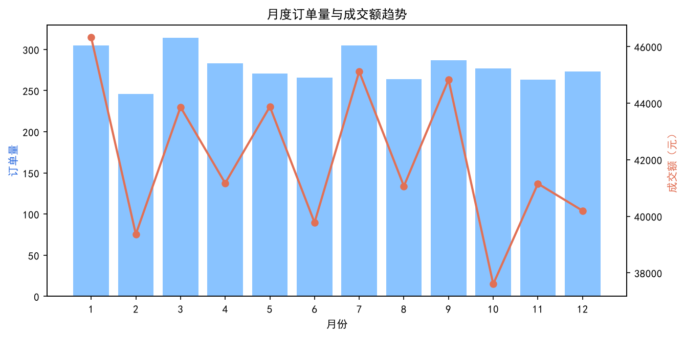
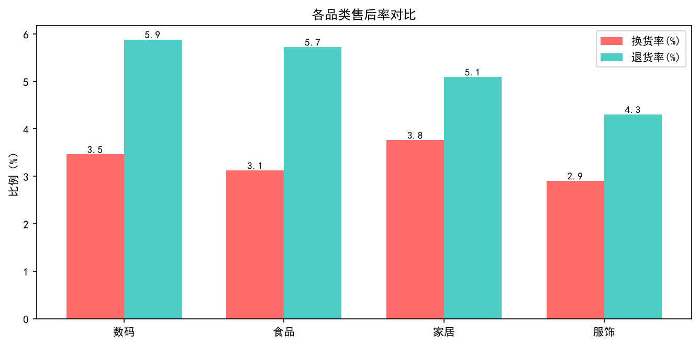
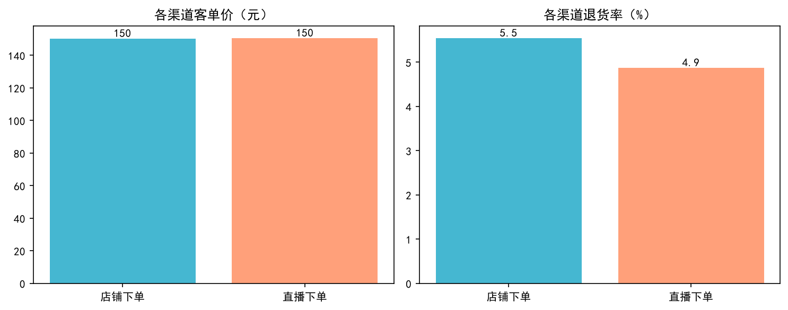

# ShopMind

一个跑在你自己电脑上的电商经营分析工具。

丢一份订单 CSV 进去，它会算出几个维度的经营指标、画好图，再让本地部署的 Qwen 模型写一份中文诊断报告。全程离线，不需要 API key。

## 怎么来的

这份数据最早是我 Python 课的期末作业：一个 notebook 从头跑到尾，读数据、算指标、画十几张图、写结论。

问题在于它只能自己看。换一份数据要改代码，结论写在报告里，图和数字在别的地方，对不上。所以这次拆开重做了一遍，清洗和计算各自成模块，画图独立出来，最后接上一个本地跑的小模型，让它负责把算好的数字讲成人话。

## 输出示例







## 代码结构

```
订单 CSV
   │
   ▼
data_loader.py    读入并清洗，补出 成交金额、交易月份 这类派生列
   │
   ▼
analyzer.py       整体概览 / 月度趋势 / 品类售后 / 渠道效率 / 会员对比
   │
   ├──▶ charts.py      画图
   │
   └──▶ report.py      拼数据简报 → 调模型 → 出诊断报告
             │
             ▼
        llm.py       OpenAI 兼容接口，本地和云端都能接
```

## 跑起来

需要 Python 3.10 以上，以及一个提供 OpenAI 兼容接口的本地模型服务（我用的是 [LM Studio](https://lmstudio.ai/)）。

先装依赖：

```bash
pip install -r requirements.txt
```

再准备模型。以 Qwen2.5-3B 的 Q4 量化版为例，用魔搭下载：

```bash
pip install modelscope
python -c "from modelscope import snapshot_download; snapshot_download('Qwen/Qwen2.5-3B-Instruct-GGUF', local_dir='D:/models/Qwen25-3B-Q4', allow_patterns=['*q4_k_m*'])"
```

在 LM Studio 里把模型目录指到那个路径，加载模型，然后到「本地模型 API」页面把服务打开，默认地址 `http://localhost:1234/v1`。

跑分析和出图：

```bash
python main.py
```

生成 AI 报告：

```bash
python src/shopmind/report.py local
```

如果加载的模型 id 和代码默认值不一样，用环境变量覆盖，不用改代码：

```bash
set SHOPMIND_MODEL=qwen2.5-3b-instruct     # Windows
export SHOPMIND_MODEL=qwen2.5-3b-instruct  # macOS / Linux
```

## 关于数据

`data/orders_raw.csv` 是用 `numpy.random.seed(2023)` 按预设分布生成的模拟数据，不是真实店铺的订单。它的作用只是验证这条链路能不能跑通，里面的结论没有任何现实含义。

换成真实数据的话，CSV 里有这几个字段就行：

`订单交易时间 / 订单编号 / 订单来源 / 用户ID / 会员 / 首次下单用户 / 性别 / 品类 / 商品单价 / 购买数量 / 活动优惠 / 换货 / 退货 / 已评价`

## 踩过的坑

写的时候折腾最久的是这两件事。

**8G 显存跑 7B 会崩。** Qwen2.5-7B 的 Q4 权重是 4.68G，看着能塞进 8G 显存，但默认上下文长度是 16K，KV cache 一加就报 `failed to allocate buffer for kv cache`。我最后换成 3B，加载只要 2.79 秒。硬要跑 7B 的话，得用 `lms load qwen2.5-7b-instruct -c 2048 --gpu max` 手动把上下文压下来。

**小模型会自己编趋势。** 第一版报告里，模型看着波动的月度数据，写出了「1-8 月销售额持续增长」。实际上 2 月、4 月、8 月都是跌的。它不是读错数字，是倾向于讲一个顺畅的故事。后来我把环比升降的月份数、最长连续同向变动、最高最低月这些判断都放到代码里算好，提示词里也明确禁止它使用「持续增长」这类词。数据的事归代码，措辞的事归模型。
