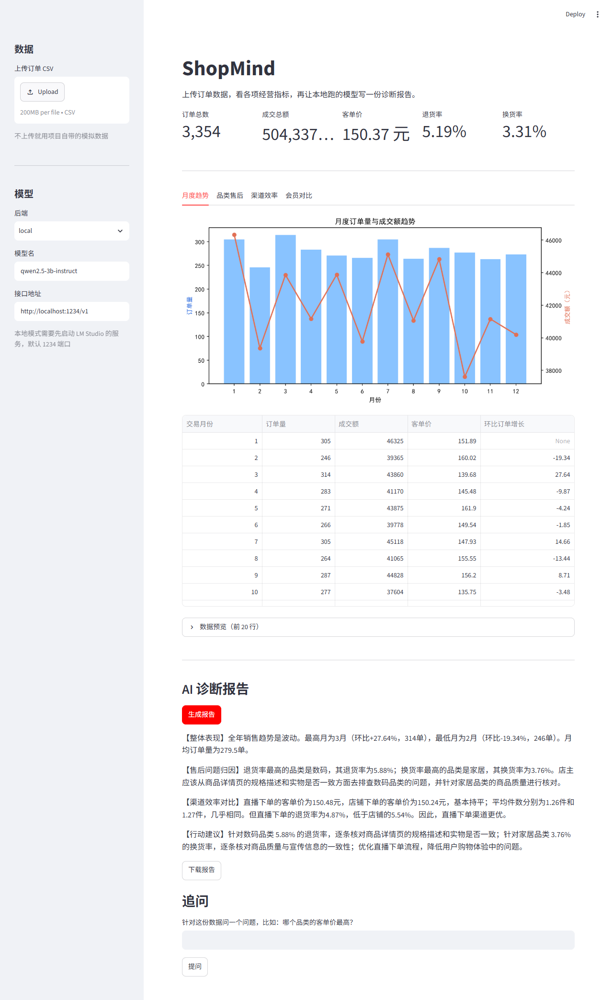

# ShopMind

本地跑的电商订单分析工具。读一份订单 CSV，算出经营指标并出图，再让本地部署的 Qwen 模型写一份中文诊断报告。有网页界面和命令行两种用法，不需要联网。



## 功能

- 数据清洗，派生成交金额、交易月份等字段
- 5 类分析：整体概览、月度趋势、品类售后、渠道效率、会员对比
- 出图 3 张
- 把分析结果交给本地模型，生成经营诊断报告
- 网页界面：上传 CSV、看指标和图、生成报告、针对数据追问

## 输出


## 安装

需要 Python 3.10 以上，和一个提供 OpenAI 兼容接口的本地模型服务。我用的是 LM Studio。

```
pip install -r requirements.txt
```

下载模型，用的是 Qwen2.5-3B 的 Q4 量化版：

```
pip install modelscope
python -c "from modelscope import snapshot_download; snapshot_download('Qwen/Qwen2.5-3B-Instruct-GGUF', local_dir='D:/models/Qwen25-3B-Q4', allow_patterns=['*q4_k_m*'])"
```

在 LM Studio 里把模型目录指到 `D:/models/Qwen25-3B-Q4`，加载模型，到「本地模型 API」页面把服务打开，默认地址 `http://localhost:1234/v1`。

## 使用

```
python main.py                        跑分析、出图
python src/shopmind/report.py local   调用本地模型生成报告
```

网页界面：

```
streamlit run app.py
```

跑起来后浏览器会自动打开 http://localhost:8501。左边可以换成自己上传的 CSV，也可以改模型名和接口地址。

Windows 上也可以直接双击 `run.bat`，等价于上面这条命令。

如果启动后马上退出，最后一行是 `OpenBLAS error: Memory allocation still failed after 10 retries`，那是 OpenBLAS 按 CPU 线程数预分配内存失败导致的，在启动前设 `set OPENBLAS_NUM_THREADS=1` 就好（`run.bat` 里已经设了）。

模型 id 和代码里不一致时，用环境变量覆盖：

```
set SHOPMIND_MODEL=qwen2.5-3b-instruct
```

## 目录

```
app.py                     网页界面
run.bat                    Windows 一键启动界面
main.py                    命令行入口
data/orders_raw.csv        订单数据（模拟生成）
output/                    图表输出
docs/screenshot.png        界面截图
tools/screenshot.py        自动截图的脚本（Playwright，可选）
src/shopmind/
  data_loader.py           清洗
  analyzer.py              指标计算
  charts.py                画图
  llm.py                   模型调用
  report.py                提示词和报告生成
```

## 说明

`data/orders_raw.csv` 是 `numpy.random.seed(2023)` 生成的模拟数据，不是真实订单。

7B 模型在 8G 显存上加载会报 `failed to allocate buffer for kv cache`，默认上下文 16K 占的显存太多。换 3B 最省事，或者在 LM Studio 里把上下文长度限制到 2048。

小模型会编数字，这是这个项目里花时间最多的地方。踩过的几个坑：

- 第一版报告把波动的月度数据写成「1-8 月销售额持续增长」，实际 2、4、8 月都在跌
- 数据用表格给它的时候，它把行看串了，写出「2 月 305 单」（305 是 1 月的）。改成一行一个月份、数值后面直接跟标签之后就没再错位
- 让它自己挑「换货率最高的品类」，它挑错，抓了那个品类的退货率来顶。现在排名类判断全部由代码算好，模型只负责措辞

现在的做法是：环比、最高最低、渠道对比这些全部在 `analyzer.py` 里算完，拼成一段结论放在提问前面，提示词要求它照抄，并禁止「持续增长」这类概括词。细节在 `report.py` 的注释里。
